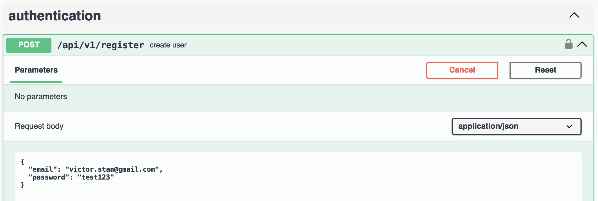

# README

## Setup

### Env

The codebase makes use of a number of environment variables which in a local development environment should be defined in the `.env` file, this file is not checked in.

The variables that need to be defined are:

```
API_SECRET_TOKEN=<your secret>
DATABASE_USERNAME=<your username>
DATABASE_PASSWORD=<your password>
```

### Database

The applicaiton is configured to use PostgreSQL. Don't forget to setup your authentication in the `.env` file

## Rspec and Swagger (API documentation generator)

The application makes use of Rswag gem: https://github.com/rswag/rswag in order to generate a _live_ API document, that can be interacted with.

### Generating Swagger docs from Rspec

Generate a new request test: `rails generate rspec:swagger Api::V1::MyController`

Generate and run tests for api definitions and views: `RAILS_ENV=test rails rswag`

### View API docs

To view the documentation, run the rails server and go to: `http://127.0.0.1:3000/api-docs/`


### Using API documentation

In the authentication section, use each of the `register` or `login` endpoints as necessary.



Once you have logged in and a token has been returned, copy and paste the `token` value (no quotes) into the top-most `Authorize` popup.


Click on the big green _Authorize_ button. You can now test queries which require authorization.


## Administration

_ActiveAdmin_ is used to generate the back-office (administration) interface which lets authenticated users edit content, such as adding new resources, etc.

To access the administration panel go to `http://127.0.0.1:3000/admin`


The default user is `admin@example.com` and password `password`

Here you can add new _artwork_ resources.


## Code documentation

### A brief introduction to the codebase

The the main features of the code, besides the standard Rails architecture, are the `services` and `queries` directories.

### Services

In the `services` directory single action service objects should be added, and these should inherit from `application_service.rb` class.

To use a service class, call it like so: `UserService::UserAuthenticator.call(user, user_params[:password])`

### Queries

The `queries` directory hosts singleton objects that take parameters and return an ActiveRecord query result. The purpose of these query services is to organize database queries in a re-usable format, and keep the Controllers and Models lean.

### Serializers

The `serializers` directory holds serializers which can be used for customizing the API output.

## What I would do if I had more time

- I did not get around to writing a data extractor from the original API data source.
- I would document code better, inline instead of just a general overview here, although the code is simple enough in this excersize, inline class documentation would be better in a realworld project.
- I would flush out complete tests for `services`, `queries`, unit tests, etc. At the moment only `request` specs exist, which are used to generate the live API documentation page.
- The administration interface is very bare-bones, it could be much improved.
